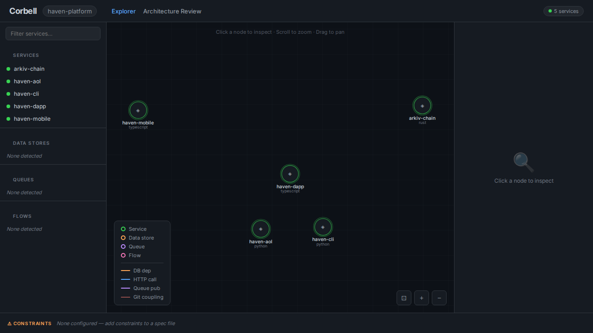

# Haven Docs

Living architecture docs for the Haven platform — generated with [Corbell](https://github.com/corbell-ai/corbell) and checked in.

**Stack:** 5 highly decoupled services, no shared DB, IPC via Candid/HTTPS + Arkiv precompile.

| Service | Repo | Language | Role | Coupling |
|---------|------|----------|------|----------|
| `arkiv-chain` | `arkiv-op-reth/` | Rust (reth + precompile `0x44…0044`) | **Entity contract** — `EntityRegistry.sol` ABI, `execute(Operation[])`, `arkiv_*` RPC (Braga `0.7.0` SDK) | **Core** — state trie, no external indexer |
| `haven-aol` | `haven-aol/` | Motoko (canister) + TS/Python SDKs | ICP VetKD gating, EIP-712 `ecrecover`, epoch cache | **Core** — deployed to `dciac-uaaaa-aaaad-qlzuq-cai` |
| `haven-dapp` | `haven-dapp/` | TypeScript / Next.js 15 | Web3 frontend (`@arkiv-network/sdk` `arkiv_query`), decrypt, cache, playback | Calls `arkiv-chain` + `haven-aol` via HTTPS/Candid |
| `haven-cli` | `haven-cli/` | Python 3.11+ | Media pipeline (`arkiv_sync.py`), encryption, archival | Calls `arkiv-chain` + `haven-aol` + Filecoin |
| `haven-mobile` | `haven-mobile/` | **Kotlin** (Compose/Media3/Room, `build.gradle.kts` `org.jetbrains.kotlin.android 2.3.21`) | Android offline-first viewer (Media3 + foc-cache) | Calls `haven-aol` via `ic-kotlin` + Arkiv via SDK |

```
haven-dapp ──┐
haven-cli  ──┼──> haven-aol (ICP VetKD v1/v3) ──> EVM RPC ──> Filecoin PIN
haven-mobile─┘         ∧
                       │   arkiv-chain (0x44…0044 precompile, arkiv_query, braga.hoodi.arkiv.network)
haven-dapp/haven-cli ──┴──> state trie (entity/pair/index accounts, roaring64 + ART)
```



*New paradigm: zero private backend — see [architecture/WEB3_PARADIGM.md](architecture/WEB3_PARADIGM.md) + [specs/haven-web3-zero-backend.md](specs/haven-web3-zero-backend.md) (LLM 10/10)*

## Layered protocol — Haven as application-layer (L7) over public networks

Haven is not a chain — it is an **application-layer protocol** (like a private tracker is an application protocol over Bittorrent/TCP) that composes four public networks as its lower layers.

| Layer | What provides it | What Haven defines on top |
|---|---|---|
| **L1-L3 Network / Consensus / Storage** | `arkiv-chain` OP L3 precompile `0x44…0044` (entity trie, `execute`, `arkiv_query`), `DFINITY ICP` canister `dciac-…qlzuq` (VetKD), **any EVM** (Ethereum/Base as gate), `Filecoin FEVM/IPFS` (`filecoin-pin`/`filecoin-pay`, `ipfs://` CIDs) | Just bytes + `eth_call` + `ecrecover` — no Haven semantics |
| **L5/L6 Session / Presentation** | `haven-aol` `GateRequest V1 (GateRequest)` / `V3 (GateRequestV3, epoch 2592000)` EIP-712 + `Attestation HAVEN_ATTEST_V1:{chain}:{tokenAddress}:{threshold}:{evmAddress}:{cidHash}:{timestamp}:{balance}` / `HAVEN_BATCH_ATTEST_V1:{…}:{merkleRoot}:{cidCount}` Ed25519 (t-Schnorr `haven_attest_v1`), plus `contractURI 0xe8a3d485` / `tokenURI 0xc87b56dd` → `gatewayNormalize ipfs://→https://ipfs.io/ipfs/` and `trustwallet/assets/.../logo.png` | *How* you prove holder and derive the VetKD key + *how* you resolve the DAO icon — the session key is per `(chain, tokenAddress, threshold, cid|epoch)` |
| **L7 Application — Haven** | Entity shape `project:haven, type:video, gate_token/gate_chain/gate_threshold, cid_hash, encryption_metadata` + rule `DAO = {chain, tokenAddress, threshold, tokenType: token|nft (nft|721|1155|is_nft)}` + `uploader ⊂ DAO` proven by `attestHolding/batchAttestHolding` over `cidHash` (reader `verifyAttestation` 30d TTL) + UI `HolderIdentity` = collection `ipfs://` image for all members of that DAO (fully public via `eth_call` contractURI, no Alchemy/OpenSea key) | This *is* the protocol: "content is a CID on Filecoin, gated by a public token/NFT, discovered via Arkiv, pinned size aggregated per gating `0x`, and identity *is* the collection icon." The 5 surfaces (`haven-dapp` TS, `haven-cli` python, `haven-mobile` Kotlin, `haven-aol` Motoko, `arkiv-chain` Rust) are just thin clients obeying the same rule set — no shared private DB. |

Outside view: 4 public networks. Inside view: one deterministic rule set. Calling it `L7` makes the Map of Zones (`docs/live`, d3-force) read as *"public universe + DAO zones sized by GB/mcap, each zone's icon is its gating token/collection, uploaders are dots inside the zone"* — the private-tracker mental model.

**What's unique:** bytes stay `AES-encrypted` on `Filecoin/IPFS` (`ipfs://` CID), indexed in `arkiv-chain 0x44…0044`, gated by any `EVM 0x` you hold (`haven-aol` VetKD `GateRequestV3` + `Attestation HAVEN_ATTEST_V1` over `cidHash`), and shown as `HolderIdentity` — the collection's `contractURI 0xe8a3d485 → https://ipfs.io/ipfs/` image for every member. No private DB (`Services:5 Datastores:0`); five thin clients, one rule set. Pin size per `gate_token` is the DAO metric in `docs/live`.

## How this was built

```bash
corbell init                    # -> corbell-data/workspace.yaml (5 services, 0 private stores) ← 2026-08-13: added arkiv-chain, haven-mobile kotlin, no shared DB
corbell graph build             # -> .corbell/workspace.db  (Services:5 Datastores:0 Edges:5)  # arkiv-chain rust + haven-aol Motoko + haven-dapp TS + haven-cli python permissionless-local + haven-mobile kotlin (was 5/1/6 shared_postgres false)
corbell ui serve --port 7433 --no-browser  # → http://localhost:7433 — D3 graph (assets/corbell-graph.png 64K, 5 services 0 stores, kotlin verified) — reshot 2026-08-13 21:35
corbell spec new --feature "Haven Web3 Zero Backend" --provider meta  # → specs/haven-web3-zero-backend.md 21K via muse-spark-1.2-contributor @ api.meta.ai/v1 ($0.28, 10/10 review) — public networks only
# -> then materialized into docs/architecture/ + entities/ for review
```

Graph store: SQLite (`.corbell/workspace.db`, 460K, now 5 services, 0 private datastores — Haven rides on **public networks only, no private backend**). No Neo4j needed. Embeddings (`sentence-transformers/all-MiniLM-L6-v2`) not required for template specs; LLM via `META_API_KEY=LLM_...` (Meta Muse Spark) now patched in `corbell/core/llm_client.py`.

> **No private backend:** All state is on public chains — **DFINITY ICP** (VetKD canister), **Arkiv OP L3** (`0x44…0044` precompile), **any EVM** (Ethereum/Base/etc. as `haven-aol` gates), **Filecoin FEVM / IPFS** (Filecoin Onchain Cloud, `filecoin-pin`/`filecoin-pay`) — verified `corbell graph build` now `Datastores:0` after fixing false `shared_postgres_db`, `haven-cli` is permissionless-local (actor-local `haven.db` SQLite per user, not shared).

## Docs layout

- `architecture/WEB3_PARADIGM.md` — **NEW** Web3 paradigm (no private backend, public chains as stores, permissionless haven-cli)
- `architecture/00-platform-overview.md` — 5 services, 0 stores, decoupled topology (updated Kotlin)
- `architecture/01-haven-aol.md` — canister API, v1/v3 preimages, EVM RPC, VetKD contexts
- `architecture/02-haven-dapp.md` — Next.js + `@arkiv-network/sdk` Arkiv reads
- `architecture/03-haven-cli.md` — permissionless-local pipeline (actor-local SQLite)
- `architecture/04-haven-mobile.md` — **Kotlin** (was TypeScript), Android v1 parity, foc-cache, Media3
- `architecture/05-arkiv-chain.md` — entity contract `0x44…0044` precompile, state trie
- `entities/ENTITY_SHAPE.md` — shared `Ident32`/`Mime128` container (source of truth)
- `entities/MEDIA_CONTENT_SPEC.md` — standardized media keys (13+13 attributes/payload)
- `specs/haven-web3-zero-backend.md` — **NEW 10/10** Web3 zero backend (regenerated 21K)
- `decisions/ADR-001-decoupled-boundaries.md` — why no shared DB
- `corbell/` — `workspace.yaml` (5 services kotlin) + `graph-summary.md` + `META_INTEGRATION.md` + 64K PNG (5 services 0 stores, kotlin)
- `api/contracts.md` — Candid + EIP-712 contracts

> All artifacts in this repo are **generated** then **reviewed** — source of truth stays in code. Re-run Corbell when services change; `corbell spec review` validates claims against the graph.
