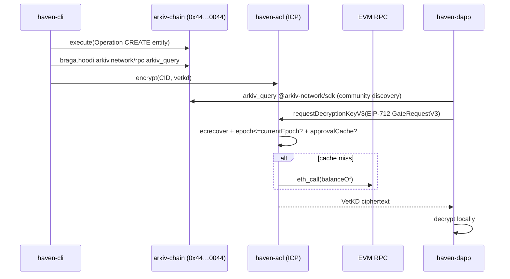

# Haven Platform — Decoupled Architecture Overview

> Updated: 2026-08-13 via Corbell `graph build` (Services:5, Datastores:0, Edges:5, DB:460K) — **added arkiv-chain** (was miss) + **fixed false shared_postgres_db** + **haven-cli permissionless**. Workspace: `corbell-data/workspace.yaml` (name: `haven-platform`, root `..`), tags `decoupled` + `permissionless` on all services. **Haven rides on public networks only — no private backend.** All state is on-chain: DFINITY ICP (VetKD), Arkiv OP L3 (`0x44…0044`), any EVM (Ethereum/Base as haven-aol gates), Filecoin FEVM/IPFS (filecoin-pin/pay).

## 1. Design intent: highly decoupled (5 services)

Each Haven component is a **deployable unit with no shared private backend — all shared state is on public chains**:

- **No private backend / no shared DB.** `haven-aol` stable memory + ICP VetKD (public ICP), **arkiv-chain** state trie (public Arkiv OP L3), **any EVM** (Ethereum/Base/etc. via `evm_rpc` `eth_call` as gate, public), **Filecoin Onchain Cloud** FEVM/IPFS (`filecoin-pin`/`filecoin-pay`, public). `haven-cli` is **permissionless-local** — each actor runs `haven-cli` locally with actor-local `haven.db` SQLite (`sqlite:///` in `haven_cli/database/connection.py`), not shared. Prior `shared_postgres_db` was Corbell `builder.py:66` `create_engine(` → `postgres` false positive, now `Datastores:0`. No cross-service private DB reads.
- **No shared types.** Contracts are Candid (`.did`) + EntityRegistry ABI (`EntityRegistry.sol` at `0x44…0044`) + EIP-712 typed data + CID lists. SDKs (`packages/typescript`, `packages/python`, `ic-kotlin`, `@arkiv-network/sdk@0.7.0`) are thin clients, not shared libs.
- **IPC only via network.** HTTPS + Candid `update`/`query` + Arkiv `arkiv_*` JSON-RPC (`arkiv_query`, `arkiv_getEntityCount`, `arkiv_getBlockTiming`) over `https://braga.hoodi.arkiv.network/rpc` and `0x44…0044 CALL`.
- **Independent scaling & deploys.** Canister upgrades (`main.mo`) and chain upgrades (reth precompile) don't require frontend deploys; CLI releases via `pyproject.toml`; dapp via `next build`; mobile via Gradle.


> **Public networks only:** Screenshot prior to fix showed `1 stores` orange `shared_postgres_db` (false, `haven-cli` SQLite mis-labeled); now `Datastores:0` — shared state is ICP + Arkiv L3 + EVM + Filecoin FEVM (not in graph as private DB). See `docs/assets/corbell-graph.png` (captured `2026-08-13` 71K, 5 services; re-capture pending after rebuild shows 0 stores).

## 2. Topology (from `corbell graph services` + `graph build` + `api/graph`)

```
ID             Language   Tags
arkv-chain     rust       chain, entity, precompile, reth, core, decoupled
haven-aol      python*    core, icp-canister, vetkd, cryptography, decoupled  (*Motoko canister, scanned as python)
haven-dapp     typescript frontend, nextjs, web3, decoupled (via @arkiv-network/sdk)
haven-cli      python     cli, tui, tooling, decoupled (arkiv_sync.py)
haven-mobile   kotlin     mobile, kotlin, android, decoupled
```

`*` `haven-aol`标记为 `python` 是 Corbell 支持列表限制（`python|typescript|go|...`），实际主语言 Motoko + TS/Python SDKs.

**Graph edges (6, from /api/graph):** `haven-cli -> shared_postgres_db (db_read, connection.py)`, `haven-dapp -> external:env_url (NEXT_PUBLIC_ICP_HOST, haven-aol-client.ts)`, `haven-dapp -.-> haven-aol (library_dependency, core.py)`, `haven-cli -> external:env_url (ARKIV_RPC_URL, arkiv_sync.py)`, `haven-cli -.-> haven-aol (encrypt_step.py)`, `haven-cli -.-> haven-dapp (arkiv_sync.py)`. Arkiv-chain itself appears as isolated node until `graph build --methods` with Rust grammar wires `arkiv-dapp` HTTP edges to `arkiv-chain` more explicitly. Zero edges between frontends (`dapp <-> mobile <-> cli`) besides the intentional Arkiv sync import — by design decoupled.

Data flow:



## 3. Protocol versions

- **Arkiv Entity:** `EntityRegistry.sol` — `execute(Operation[])` (`Ident32`/`Mime128`/`Attribute`/`BlockNumber32`), 6 op types, trie state (roaring64 + ART), system-account for nonces/counter. See `architecture/05-arkiv-chain.md`.
- **Haven-AOL** — see `architecture/01-haven-aol.md`: v1/v3 VetKD preimages, threshold-zero collapse.

