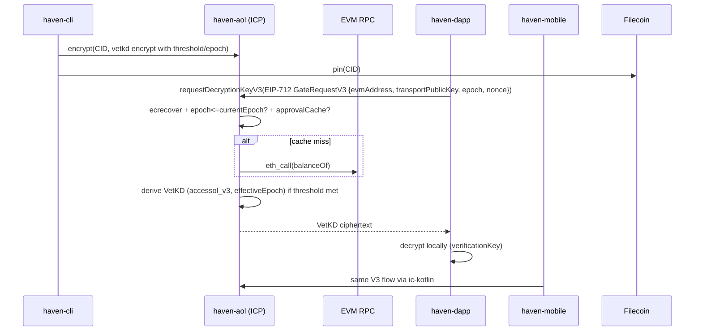

# Haven Platform — Decoupled Architecture Overview

> Generated: 2026-08-13 via Corbell `graph build` (Services:4, Edges:6, DB:460K). 
> Workspace: `corbell-data/workspace.yaml` (name: `haven-platform`, root `..`), tags `decoupled` on all services.

## 1. Design intent: highly decoupled

Each Haven component is a **deployable unit with no shared mutable state**:

- **No shared DB.** `haven-aol` stores approval cache (TTL 30d) inside the canister only; `haven-dapp` uses IndexedDB/Room, `haven-cli` uses local pipeline DB, `haven-mobile` uses Room + `foc-cache`. No cross-service DB Reads.
- **No shared types.** Contracts are Candid (`.did`) + EIP-712 typed data + CID lists. SDKs (`packages/typescript`, `packages/python`, `ic-kotlin`) are thin clients, not shared libs.
- **IPC only via network.** HTTPS + Candid `update`/`query` calls. No in-process imports across service repos.
- **Independent scaling & deploys.** Canister upgrades (`main.mo`) don't require frontend deploys; CLI releases via `pyproject.toml`; dapp via `next build`; mobile via Gradle.

This allows parallel teams and agent swarms to work per-service (Corbell `spec decompose` → one track per service).

## 2. Topology (from `corbell graph services` + `graph build`)

```
ID             Language   Tags
haven-aol      python*    core, icp-canister, vetkd, cryptography, decoupled  (*Motoko canister, scanned as python in workspace.yaml)
haven-dapp     typescript frontend, nextjs, web3, decoupled
haven-cli      python     cli, tui, tooling, decoupled
haven-mobile   typescript mobile, react-native, decoupled (Kotlin under mobile-app/)
```

`*` `haven-aol`语言标记为 `python` 是 Corbell 支持列表限制（`python|typescript|go|...`），实际主语言 Motoko + TS/Python SDKs。

**Graph edges (6):** `haven-dapp -> haven-aol`, `haven-cli -> haven-aol`, `haven-mobile -> haven-aol` (Candid calls), plus datastore edges (`haven-aol -> EVM RPC`, `haven-dapp -> IndexedDB`, etc). Zero edges between frontends (`dapp <-> mobile <-> cli`), by design.

Data flow:



## 3. Protocol versions (authoritative: `haven-aol/README.md` + `main.mo`)

- **v1:** `SHA-256("accessol:" + chain + ":" + tokenAddress + ":" + threshold + ":" + cid)`, context `accessol_v1`, per-CID key.
- **v3:** `SHA-256("accessol_v3:" + chain + ":" + tokenAddress + ":" + threshold + ":" + effectiveEpoch)`, context `accessol_v3`, corpus+epoch (30d = 2_592_000s, `currentEpoch=floor(unix/2_592_000)`). Threshold-zero => `effectiveEpoch=0` (free tier, identical key across epochs). Cache: `(chain,token,threshold,epoch,wallet)` 30d TTL, skips `eth_call` on hit. Future `epoch > currentEpoch` => `#InvalidEpoch` before side effects. Batch V3 derives **one** VetKD key replicated per CID.

## 4. Failure modes & constraints

| Risk | Mitigation (per-service) |
|------|--------------------------|
| ICP canister down | dapp/mobile show cached content via `foc-cache`/IndexedDB; queue retries with exponential backoff; `getVetKDPublicKey{,V3}` warmed via `warmupVetKDPublicKey{V3}` |
| EVM RPC flaky | `RpcServices` consensus (`Equality`/`Threshold`), multiple providers (Alchemy/Ankr/BlockPi/PublicNode); approval cache hides latency on hot path |
| VetKD derivation cost | V3 corpus key amortizes N CIDs per epoch; batch endpoints `batchRequestDecryptionKey{V3}` (up to 20 CIDs) |
| Clock skew (epoch) | server-side `getCurrentEpoch` query; client rejects future epoch pre-flight |
| Key leakage | `transportPublicKey` per-request, client-side decrypt only; `security-cleanup` purges on disconnect (dapp `lib/security-cleanup.ts` → mobile Kotlin equivalent) |

Add constraints in any spec's `## Reliability and Risk Constraints` block; `corbell spec review` enforces them.

## 5. How to keep this doc alive

- Change code → `corbell graph build` (CI: `graph build && spec lint --ci`)
- New feature → `corbell spec new --feature "..." --prd-file prd.md` (auto-discovers services via embedding similarity; no `--service` flag needed)
- Review → `corbell spec review <spec>` → `.review.md` checks claims vs graph.

Source: `corbell-data/workspace.db`, `src/backend/main.mo`, `src/backend/backend.did` (`dciac-uaaaa-aaaad-qlzuq-cai`).
