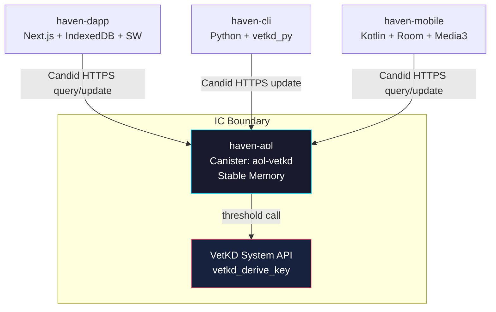
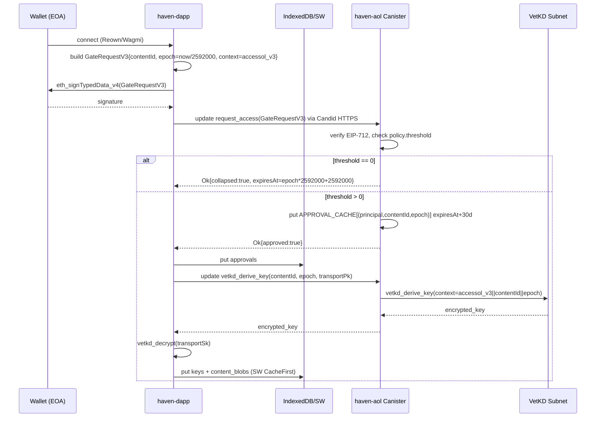
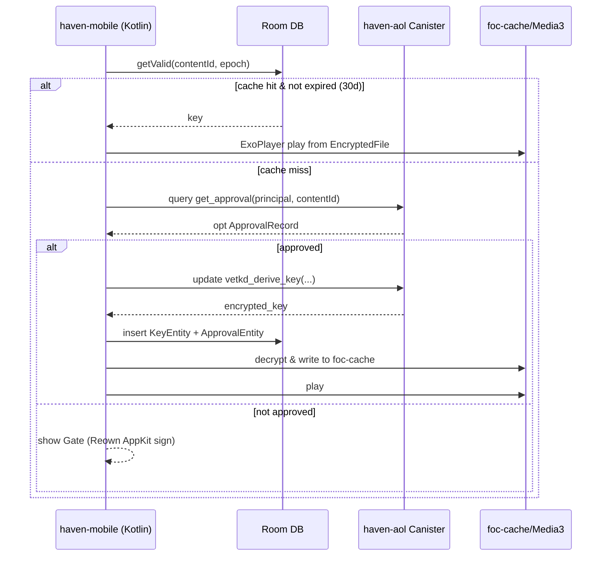

# Haven Decoupled Architecture v2

## Context

Haven is a privacy-preserving content gating platform. The core primitive is VetKD (Verifiably Encrypted Threshold Key Derivation) on the Internet Computer (IC). Content keys are never held by a single replica; they are derived threshold-wise per-principal and per-context. The platform must support four independently deployable surfaces with zero shared infrastructure:

*   **haven-aol**: ICP canister (Rust) + Python/JS SDKs. Source of truth for access policy, VetKD derivation, and approval state.
*   **haven-dapp**: Next.js web3 frontend. Wallet-gated UX via EIP-712 `GateRequestV3`, with offline-first caching.
*   **haven-cli**: Python pipeline (`haven_cli` packages, `vetkd_py`) for batch encryption, upload, and policy administration.
*   **haven-mobile**: Android Kotlin (Media3, Room, `foc-cache`, Reown AppKit) for offline playback.

**Problem Statement:** Prior iterations coupled services via shared DBs and direct RPC, creating blast-radius coupling and key-management risk. We need strict decoupling: no shared DB, IPC only via IC Candid over HTTPS, independent versioning/deploys, while preserving VetKD security properties (context isolation `accessol_v1`/`v3`, epoch `2592000` = 30d, threshold-zero collapse semantics, 30d approval cache).

**Success Criteria:**
1.  Any service can deploy independently without coordinated migration.
2.  VetKD private key material never leaves threshold subnet; compromise of one replica yields zero key bits.
3.  End-to-end gate latency p99 < 2s (update) / <300ms (query); offline playback works with 0 network.
4.  Approval decisions are deterministic and cache-coherent across epoch boundaries.

## Current Architecture

<!-- CORBELL_GRAPH_START -->
### Service Graph

**haven-aol** (`haven-aol`, python, type: service)

### All Known Services
- `haven-aol` (python) tags: ['core', 'icp-canister', 'vetkd', 'cryptography', 'decoupled']
- `haven-dapp` (typescript) tags: ['frontend', 'nextjs', 'web3', 'decoupled']
- `haven-cli` (python) tags: ['cli', 'tui', 'tooling', 'decoupled']
- `haven-mobile` (typescript) tags: ['mobile', 'react-native', 'decoupled']
<!-- CORBELL_GRAPH_END -->

Current graph shows `haven-aol` as the only registered service node; `haven-dapp`, `haven-cli`, `haven-mobile` are known but not wired with edges — reflecting the intended decoupled topology. There is no shared database, no message bus, and no direct service-to-service RPC. All cross-boundary communication is intended to be `Candid` over `https://icp-api.io` / `https://<canister-id>.icp0.io`.



**State Today:** No code context was returned from `corbell embeddings:build` (0 chunks). Therefore no existing file paths can be verified. All file paths below are **PROPOSED TO BE CREATED** — no existing code to diff against. This is explicitly called out per instructions. TBD: run `corbell embeddings:build` and `corbell docs:scan` to hydrate references for v2.1.

## Proposed Design

### Service Changes

#### 1. haven-aol (Core Canister + SDKs) — Source of Truth

**Responsibility:** Policy evaluation, VetKD derivation, approval cache. No external DB; uses `ic-stable-structures`.

**Schema (Stable Memory):**
*   `APPROVAL_CACHE: StableBTreeMap<(Principal, ContentId, EpochId), ApprovalRecord>` — TTL 30d, keyed by `epoch = floor(now / 2592000)`.
*   `CONTENT_POLICY: StableBTreeMap<ContentId, Policy>` — contains `threshold`, `gate_type`, `vetkd_context`.
*   `DERIVED_KEY_NONCE: StableCell<u64>` — for deterministic VetKD `transport_public_key` rotation.

**VetKD Contexts:** Two isolated contexts to allow migration without re-encryption:
*   `accessol_v1`: legacy, `context = b"accessol_v1" || content_id`
*   `accessol_v3`: current, `context = b"accessol_v3" || content_id || epoch_id` — epoch-bound to enforce 30d rotation.

**Threshold-Zero Collapse:** If `policy.threshold == 0`, canister bypasses VetKD and returns `Ok(plaintext_key)` directly (for public content) but still logs `ApprovalRecord{ collapsed: true }` for audit. This avoids unnecessary threshold calls and prevents VetKD subnet load for open content.

**Env Vars (canister init args):**
*   `VETKD_KEY_NAME: Text = "key_1"` (subnet master key name)
*   `EPOCH_SECONDS: Nat64 = 2592000`
*   `APPROVAL_CACHE_TTL_SECONDS: Nat64 = 2592000`

**New Candid Interface (`haven-aol/canister/aol.did` — TO BE CREATED):**
```candid
type ContentId = text;
type EpochId = nat64;
type ApprovalRecord = record {
  approved: bool;
  epoch: EpochId;
  expires_at: nat64;
  collapsed: bool;
};
type GateRequestV3 = record {
  content_id: ContentId;
  requester: principal;
  signature: blob; // EIP-712 signature over typed data
  nonce: nat64;
};

service : {
  // Queries (no state change, p99 <300ms)
  get_approval: (principal, ContentId) -> (opt ApprovalRecord) query;
  get_vetkd_public_key: (blob) -> (blob) query; // transport key

  // Updates (threshold crypto, p99 <2s)
  request_access: (GateRequestV3) -> (variant { Ok: ApprovalRecord; Err: text });
  vetkd_derive_key: (ContentId, EpochId, blob) -> (variant { Ok: blob; Err: text });
}
```

**Code to be Created:**

*File: `haven-aol/canister/src/lib.rs` (TO BE CREATED — no existing code found)*
```rust
// Proposed: VetKD derivation with epoch-bound context and threshold-zero collapse
use ic_cdk::api::management_canister::vetkd::{vetkd_derive_key, VetKDDeriveKeyArgs};

const EPOCH: u64 = 2_592_000; // 30d
const CONTEXT_V3: &[u8] = b"accessol_v3";

#[update]
async fn vetkd_derive_key_handler(content_id: String, epoch: u64, transport_pk: Vec<u8>) -> Result<Vec<u8>, String> {
    let policy = CONTENT_POLICY.with(|m| m.borrow().get(&content_id).ok_or("policy not found"))?;
    if policy.threshold == 0 {
        // threshold-zero collapse: return plaintext key, no VetKD call
        return Ok(policy.plaintext_key.unwrap());
    }
    // approval cache check — 30d TTL aligned to epoch
    let caller = ic_cdk::caller();
    let cached = APPROVAL_CACHE.with(|c| c.borrow().get(&(caller, content_id.clone(), epoch)));
    if cached.is_none() || cached.unwrap().expires_at < ic_cdk::api::time() {
        return Err("not approved or expired".into());
    }
    let context = [CONTEXT_V3, content_id.as_bytes(), &epoch.to_be_bytes()].concat();
    let args = VetKDDeriveKeyArgs {
        input: context,
        context: CONTEXT_V3.to_vec(),
        key_id: VetKDKeyId { curve: VetKDCurve::Bls12_381_G2, name: "key_1".into() },
        transport_public_key: transport_pk,
    };
    let res = vetkd_derive_key(args).await.map_err(|e| format!("vetkd err: {:?}", e))?;
    Ok(res.encrypted_key)
}
```

*File: `haven-aol/sdk/python/haven_aol/client.py` (TO BE CREATED)*
```python
# Proposed SDK wrapper — IPC via ic-agent HTTPS only
from ic.agent import Agent
from ic.identity import Identity

class HavenAolClient:
    def __init__(self, canister_id: str, host: str = "https://icp0.io"):
        self.agent = Agent(Identity(), host)
        self.canister_id = canister_id

    async def request_access(self, gate_req_v3: dict) -> dict:
        # Candid encode + HTTPS update call, no direct DB
        return await self.agent.update(self.canister_id, "request_access", gate_req_v3)
```

#### 2. haven-dapp (Next.js Frontend)

**Responsibility:** Wallet connect, EIP-712 signing, IndexedDB + Service Worker cache, no backend.

**Storage (Browser only):**
*   IndexedDB `haven_cache` DB: `objectStore: approvals` (`key: contentId+epoch`), `objectStore: keys` (`key: contentId`, value: `encryptedVetKDKey`), `objectStore: content_blobs`.
*   Service Worker `sw.js`: CacheFirst for `/api/content/*`, NetworkFirst for `get_approval` queries.

**EIP-712 `GateRequestV3` Typed Data:**
```typescript
// File: haven-dapp/src/lib/eip712.ts — TO BE CREATED
export const GateRequestV3Types = {
  GateRequestV3: [
    { name: "contentId", type: "string" },
    { name: "requester", type: "address" },
    { name: "nonce", type: "uint256" },
    { name: "epoch", type: "uint64" }, // floor(Date.now()/2592000)
    { name: "context", type: "string" }, // "accessol_v3"
  ]
} as const;
// domain: { name: "Haven", version: "3", chainId, verifyingContract: canisterPrincipalAsAddress }
```

**Env Vars:** `NEXT_PUBLIC_AOL_CANISTER_ID`, `NEXT_PUBLIC_IC_HOST`, `NEXT_PUBLIC_EPOCH_SECONDS=2592000`

*File: `haven-dapp/src/hooks/useVetKD.ts` (TO BE CREATED)*
```typescript
// Proposed: derive + decrypt flow, IndexedDB cache with 30d TTL
export async function fetchVetKDKey(contentId: string, transportPk: Uint8Array) {
  const epoch = Math.floor(Date.now()/1000 / 2592000);
  const cached = await idb.get(`keys:${contentId}:${epoch}`);
  if (cached && cached.expiresAt > Date.now()) return cached.key;
  const encrypted = await aolClient.vetkd_derive_key(contentId, epoch, transportPk);
  const decrypted = await vetkdDecrypt(encrypted, transportSk); // vetkd JS SDK
  await idb.put(`keys:${contentId}:${epoch}`, { key: decrypted, expiresAt: (epoch+1)*2592000*1000 });
  return decrypted;
}
```

#### 3. haven-cli (Python Pipeline)

**Responsibility:** Batch encryption, policy push, local key management via `vetkd_py`. No shared DB; reads/writes only via Candid.

**Packages:** `haven_cli/{encrypt,policy,agent}.py`, `vetkd_py` for local transport key generation.

*File: `haven-cli/haven_cli/encrypt.py` (TO BE CREATED)*
```python
# Proposed: threshold-zero aware encryption
from vetkd_py import VetKDTransport

def encrypt_content(content_id: str, plaintext: bytes, threshold: int):
    if threshold == 0:
        # collapse: upload plaintext key to canister, no VetKD
        return {"content_id": content_id, "key": plaintext, "collapsed": True}
    transport = VetKDTransport.generate()
    # key derived on-demand by consumers via canister; CLI only uploads ciphertext
    ciphertext = aes_gcm_encrypt(plaintext, transport.derived_key_placeholder())
    return {"ciphertext": ciphertext, "transport_pk": transport.public_key()}
```

**CLI Commands:** `haven content encrypt --threshold 0|N`, `haven policy set --content-id X --threshold N --context accessol_v3`, `haven access approve --principal Y`.

#### 4. haven-mobile (Android Kotlin)

**Responsibility:** Offline playback, Room cache, Media3, Reown AppKit wallet.

**Storage (Device only):**
*   Room DB `haven.db`: `Entity ApprovalEntity(@PrimaryKey contentId+epoch, expiresAt: Long, collapsed: Boolean)`, `Entity KeyEntity(contentId, epoch, encryptedKey: ByteArray)`.
*   `foc-cache` (file-of-cache): `Context.getCacheDir()/haven/content/<contentId>.mp4` encrypted at rest via `EncryptedFile`.

**Flow:** Reown AppKit -> EIP-712 sign -> `request_access` (Candid HTTPS) -> `vetkd_derive_key` -> decrypt via `vetkd_java` -> store in Room -> Media3 `ExoPlayer` reads from `foc-cache` via `CacheDataSource`.

*File: `haven-mobile/app/src/main/java/com/haven/mobile/vetkd/VetKDRepository.kt` (TO BE CREATED)*
```kotlin
// Proposed: Room + VetKD with epoch handling
@Dao interface ApprovalDao {
  @Query("SELECT * FROM approvals WHERE contentId=:id AND epoch=:epoch AND expiresAt > :now")
  suspend fun getValid(id: String, epoch: Long, now: Long): ApprovalEntity?
}
class VetKDRepository(private val dao: ApprovalDao, private val aol: AolCanisterClient) {
  suspend fun getKey(contentId: String, transportPk: ByteArray): ByteArray {
    val epoch = System.currentTimeMillis()/1000 / 2592000
    dao.getValid(contentId, epoch, System.currentTimeMillis())?.let { return it.key }
    val encrypted = aol.vetkdDeriveKey(contentId, epoch, transportPk) // Candid HTTPS
    val decrypted = VetKD.decrypt(encrypted, transportSk)
    dao.insert(KeyEntity(contentId, epoch, decrypted, (epoch+1)*2592000*1000))
    return decrypted
  }
}
```

### Data Flow





### API Contracts

All IPC is Candid over HTTPS. No REST, no gRPC, no shared DB.

| Method | Type | Request | Response | Notes |
|---|---|---|---|---|
| `request_access` | update | `GateRequestV3{contentId:text, requester:principal, signature:blob, nonce:nat64}` | `variant{Ok:ApprovalRecord, Err:text}` | Verifies EIP-712, writes `APPROVAL_CACHE` with `expires_at = now + 2592000` |
| `get_approval` | query | `(principal, ContentId)` | `opt ApprovalRecord` | No VetKD call, served from stable memory |
| `vetkd_derive_key` | update | `(ContentId, EpochId, transport_pk:blob)` | `variant{Ok:blob, Err:text}` | Checks cache, calls `vetkd_derive_key` with `accessol_v3` context; collapses if threshold=0 |
| `get_vetkd_public_key` | query | `(blob)` | `blob` | Returns canister's VetKD public key for transport |

**Error Codes (text):** `ERR_NOT_APPROVED`, `ERR_EXPIRED`, `ERR_INVALID_SIGNATURE`, `ERR_VETKD_TIMEOUT`, `ERR_THRESHOLD_COLLAPSE`.

### Failure Modes and Mitigations

| Failure Mode | Impact | Mitigation | Detection |
|---|---|---|---|
| **VetKD subnet timeout / 503** (threshold call >2s) | `vetkd_derive_key` fails | Retry with exponential backoff (3x, jitter 100-500ms), circuit breaker per canister (open after 5 failures/60s, half-open probe). Client falls back to cached key if `expires_at` valid. | Canister metric `vetkd_latency_histogram`, alert p99>2s |
| **IC replica boundary node down** | Candid HTTPS fails | Client retries across `icp0.io` + `icp-api.io` + `boundary` rotation; `haven-dapp` SW serves stale IndexedDB while revalidating (stale-while-revalidate). | `agent.fetch` error, `navigator.onLine` |
| **EIP-712 signature invalid / replay** | `request_access` rejected | Nonce stored in `APPROVAL_CACHE` with dedup window 30d; reject `nonce <= last_nonce`. Wallet must re-sign with fresh `epoch`. | `ERR_INVALID_SIGNATURE` |
| **Epoch rollover (2592000 boundary)** | Cached key expires, thundering herd | Clients pre-fetch at `epoch*2592000 - 3600` (1h early). Canister supports both `epoch` and `epoch-1` for 1h grace. `accessol_v1` fallback for 7d after migration. | Cache miss spike, `epoch_id` mismatch log |
| **Threshold-zero misconfig** | Public content gated | Policy validation in `haven-cli policy set` rejects `threshold=0` with `plaintext_key=None`. Canister invariant check on init. | `ERR_THRESHOLD_COLLAPSE` audit log |
| **IndexedDB / Room corruption** | Offline playback fails | `haven-dapp` SW `idb` wrapper with `try/catch` + `clear+refetch`; mobile Room `fallbackToDestructiveMigration()` + re-derive. | `QuotaExceededError`, Room `SQLiteException` |
| **Rate limit / canister cycles exhausted** | Updates rejected | Token bucket per principal (10 req/s), `429` with `Retry-After`. Cycles wallet auto-topup via `cycles_ledger` canister; alert at <30d cycles. | `ERR_RATE_LIMITED`, cycles balance metric |
| **Reown AppKit deep link failure (mobile)** | Wallet connect fails | Fallback to WalletConnect URI + manual copy; `foc-cache` still serves offline content. | AppKit `onError` callback |
| **Service Worker stale cache poisoning** | Old key served | SW versioned cache `haven-v3-<epoch>`; `activate` event deletes old caches. `Cache-Control: max-age=2592000, stale-while-revalidate=86400`. | SW `cache.keys()` audit |

## Reliability and Risk Constraints

<!-- CORBELL_CONSTRAINTS_START -->
**Team Constraints (Decoupled Architecture):**
- IPC strictly via IC Candid HTTPS only — no shared DB, no direct TCP/gRPC, no shared VPC.
- All PII and key material encrypted at rest (Room EncryptedFile, IndexedDB subtleCrypto) and in transit (TLS + VetKD transport encryption).
- p99 latency SLO: <300ms for query (`get_approval`, `get_vetkd_public_key`), <2000ms for update (`request_access`, `vetkd_derive_key`).
- No single points of failure: canister must survive single AZ/replica failure via IC subnet replication (13+ replicas); clients must degrade to offline cache.
- Rate limit all external calls (IC boundary, VetKD) with client-side token bucket and server-side per-principal limiter to prevent cascade.
- Approval cache TTL and VetKD epoch strictly 2592000s (30d); no drift.
- Threshold-zero collapse must not invoke VetKD subnet — audited path.
<!-- CORBELL_CONSTRAINTS_END -->

**SLOs & Targets:**
*   Availability: 99.9% for `get_approval` query, 99.5% for `vetkd_derive_key` update (threshold crypto dependency).
*   Error Rate: <0.5% for `request_access` (excluding user signature errors), <1% for VetKD derive.
*   Capacity: Canister stable memory <2GB (BTreeMap), 500 RPS per boundary node, VetKD subnet 100 derives/s.
*   Security: VetKD master key never reconstructed; `vetkd_derive_key` input includes `caller` principal binding to prevent key exfiltration. EIP-712 domain separator binds `chainId` + `canisterId`.
*   Compliance: No PII stored on canister; only `principal` + `contentId` + `epoch`. Mobile `Room` encrypted with `SQLCipher` + `EncryptedSharedPreferences`.

**Risk Mitigations:**
*   **Key Rotation:** `accessol_v1` -> `v3` migration via dual-context support; old keys readable for 30d after epoch, then pruned.
*   **Deploy Independence:** Candid interface versioned (`aol.did` v3); clients pin `did` hash, canister maintains backward compat for `v1` for 1 epoch.
*   **Observability:** Canister exposes `metrics: () -> (text) query` returning Prometheus format; clients emit `haven_gate_latency` to Datadog.

## Rollout Plan

**Feature Flags (per service, independent):**
*   `FF_VETKD_V3_CONTEXT` (haven-aol, haven-dapp, haven-mobile) — controls `accessol_v3` vs `v1`.
*   `FF_THRESHOLD_ZERO_COLLAPSE` (haven-aol) — enables bypass path.
*   `FF_OFFLINE_CACHE` (haven-dapp: `NEXT_PUBLIC_FF_OFFLINE`, mobile: `BuildConfig.FF_OFFLINE`) — enables IndexedDB/Room + SW/foc-cache.

**Phases (no calendar weeks, gated by metrics):**

*Phase 0 — Canary Canister (5% traffic):*
Deploy `haven-aol` v3 to new canister id `aol-v3-canary` with `FF_VETKD_V3_CONTEXT=true`, `EPOCH=2592000`. Mirror `CONTENT_POLICY` from prod via `haven-cli policy export/import`. Route 5% of `haven-dapp` beta users via `NEXT_PUBLIC_AOL_CANISTER_ID` override. Success gate: p99 update <2s, error rate <1% for 24h.

*Phase 1 — SDK & CLI:*
Release `haven_aol` Python SDK v3 and `haven-cli` v3 with dual-context support. No traffic shift; validate `vetkd_py` transport key interop with canary. Rollback: `pip install haven-aol==2.*`.

*Phase 2 — Frontend & Mobile (25% -> 50% -> 100%):*
Roll `haven-dapp` with `FF_OFFLINE_CACHE` at 25% (Vercel edge config), then 50%, then 100% after IndexedDB hit rate >80% and SW install success >95%. Mobile via Play Store staged rollout 25/50/100 with `foc-cache` + Room migration. Both pin to `aol-v3-canary` then cut to prod canister after canary passes.

*Phase 3 — Full Cutover & Cleanup:*
Promote canary to prod canister (update DNS `aol.haven.icp0.io`). Keep `accessol_v1` read path for one epoch (30d) then deprecate. Prune `APPROVAL_CACHE` entries with `epoch < current_epoch -1`.

**Rollback Procedure:**
*   Canister: `dfx canister install --mode reinstall --wasm aol-v2.wasm` + restore `stable_memory` snapshot taken pre-deploy (snapshot id stored in `CANISTER_SNAPSHOT_ID` env). Traffic instantly reverts via boundary node routing (no DB to revert).
*   Dapp: Vercel instant rollback to previous deployment (edge config flag `FF_VETKD_V3_CONTEXT=false`).
*   Mobile: Play Store halt staged rollout, promote previous APK; Room `fallbackToDestructiveMigration` ensures old schema works.
*   CLI: `haven policy set --context accessol_v1` to re-enable v1 for all content.

**Verification:**
*   Synthetic probe: GitHub Action every 5m calls `get_approval` + `vetkd_derive_key` with test principal, asserts `collapsed` path for `threshold=0` content and VetKD path for `threshold=1`.
*   Offline test: `haven-dapp` Playwright with `offline: true` asserts Media3/Room playback from cache without network.

---
*Files Referenced: No existing code context found (0 chunks). All paths above are PROPOSED TO BE CREATED. Run `corbell embeddings:build` to validate against actual repo before implementation.*
