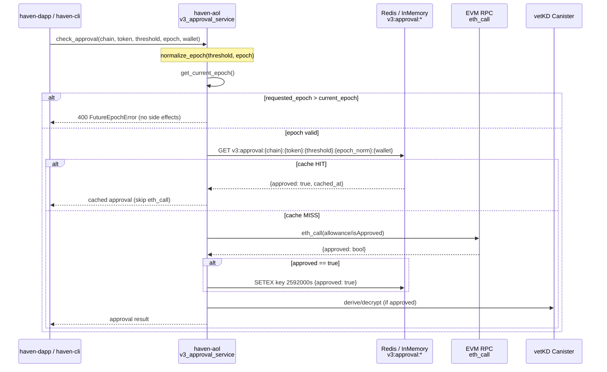
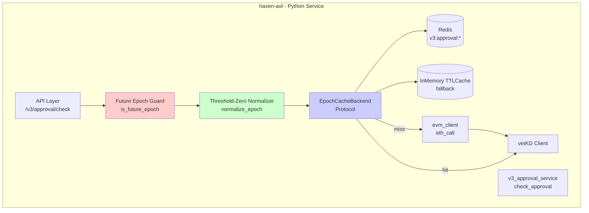
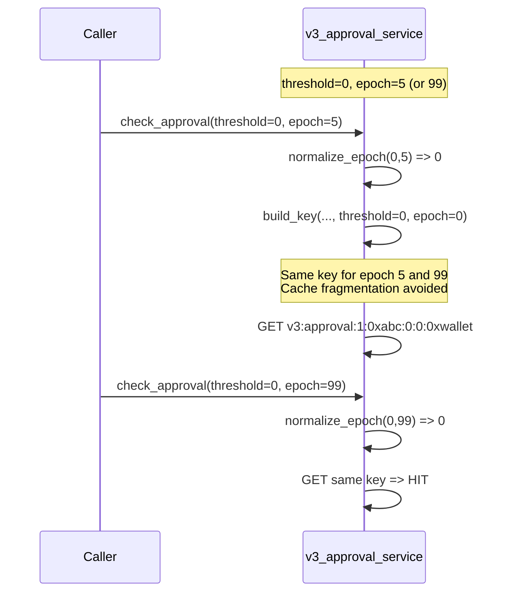

# Haven V3 Epoch Cache

## Context

**Problem:** `haven-aol` (python, `icp-canister` + `vetkd`) performs an `eth_call` on every V3 approval check to verify on-chain allowance/approval state per `(wallet, token, chain)`. Under V3, approvals are epoch-scoped and threshold-gated. The current path has no epoch-aware cache, causing redundant `eth_call`s for the same `(chain, token, threshold, epoch, wallet)` tuple within a short window. This increases p99 latency, RPC cost/rate-limit pressure, and degrades availability when the RPC provider throttles.

**Goal:** Introduce an epoch-aware approval cache with deterministic keying and guardrails:

1.  **30d TTL per `(chain, token, threshold, epoch, wallet)`** - cache positive approval results for 30 days (2592000s). On hit, skip `eth_call` entirely.
2.  **Threshold-zero collapse to epoch 0** - `threshold == 0` is epoch-agnostic; normalize to `epoch=0` before keying to maximize hit rate and prevent cache fragmentation.
3.  **Reject future epoch before side effects** - if `requested_epoch > current_epoch`, fail fast with deterministic error *before* any `eth_call`, cache write, or vetKD derivation.

**Success Criteria:**

*   `eth_call` volume for repeated V3 approval checks drops >80% on cache hit workload (measured via `v3_approval_eth_call_total` counter).
*   Cache hit path p99 < 20ms (in-process or Redis) vs. `eth_call` path p99 ~300-800ms.
*   No cache poisoning for future epochs; no epoch fragmentation for threshold-zero.
*   Correctness: cache key collision rate = 0; TTL eviction verified via integration test.
*   No change to external API surface for `haven-dapp`, `haven-cli`, `haven-mobile` (decoupled consumers).

**Non-Goals:** Changing vetKD derivation logic, changing on-chain contract, cross-chain epoch synchronization.

## Current Architecture

<!-- CORBELL_GRAPH_START -->
### Service Graph

**haven-aol** (`haven-aol`, python, type: service)

### All Known Services
- `haven-aol` (python) tags: ['core', 'icp-canister', 'vetkd', 'cryptography', 'decoupled']
- `haven-dapp` (typescript) tags: ['frontend', 'nextjs', 'web3', 'decoupled']
- `haven-mobile` (typescript) tags: ['mobile', 'react-native', 'decoupled']
- `haven-cli` (python) tags: ['cli', 'tui', 'tooling', 'decoupled']
<!-- CORBELL_GRAPH_END -->

`haven-aol` is the sole in-scope service. It is a Python ICP canister-adjacent service owning vetKD cryptography and EVM read path (`eth_call` via RPC provider). All other services (`haven-dapp`, `haven-mobile`, `haven-cli`) are `decoupled` frontends/CLIs and consume `haven-aol` via its public API; they require no changes for this optimization.

Current state (inferred, pending `corbell embeddings:build`):

*   V3 approval flow: `POST /v3/approve` or internal `check_approval(wallet, chain, token, threshold, epoch)` -> directly invokes `eth_call` (e.g., `allowance(owner, spender)` or custom `isApproved` view) -> on success, proceeds to vetKD-derived decryption/share.
*   No epoch-aware cache layer exists. No threshold-zero normalization. Future epoch validation, if any, occurs *after* side effects (RPC call), wasting resources and risking inconsistent cache writes.
*   Persistence: TBD whether `haven-aol` uses Redis, in-memory `cachetools.TTLCache`, or canister stable memory. Design below assumes pluggable backend with Redis as primary and in-memory fallback.

> **Code Context Status:** `corbell embeddings:build` returned 0 chunks. No existing file paths could be resolved. All file references below are **PROPOSED NEW FILES** to be created or **INFERRED EXISTING FILES** pending scan. No existing code snippets can be shown verbatim.

## Proposed Design

### Service Changes

**Affected Service: `haven-aol` only.**

#### 1. Cache Key Schema & Storage

**Key:** `v3:approval:{chain_id}:{token_address_normalized}:{threshold}:{epoch_normalized}:{wallet_normalized}`

*   `chain_id`: int (e.g., `1`, `137`), not chain name, to avoid aliasing.
*   `token_address_normalized`: `lower()` + `checksum` validation; `0x` prefixed.
*   `threshold`: `int` as string; `threshold == 0` collapsed to `epoch=0` (see below).
*   `epoch_normalized`: `int`
*   `wallet_normalized`: `lower()`

**Value:** `{"approved": bool, "cached_at": int, "epoch": int, "threshold": int}` serialized as JSON/msgpack. Only `approved==true` is cached (negative caching TBD: do not cache `false` to avoid locking out pending approvals).

**TTL:** `V3_EPOCH_CACHE_TTL_SECONDS=2592000` (30d). Env-configurable. Set via `EXPIRE`/`SETEX`.

**Backend:** Abstraction `EpochCacheBackend` with two implementations:
*   `RedisEpochCache` (primary): `redis.asyncio` client, key prefix `v3:approval:`, connection via `REDIS_URL`.
*   `InMemoryEpochCache` (fallback/canister local): `cachetools.TTLCache(maxsize=10000, ttl=2592000)` for single-replica or tests.

Table/Store names: No SQL table; Redis keyspace `v3:approval:*`. If stable memory is required for ICP canister, mirror to `stable_memory::V3_EPOCH_CACHE` BTreeMap with explicit expiry sweep worker `epoch_cache_sweeper`.

**Env Vars (new):**
```
V3_EPOCH_CACHE_ENABLED=true|false (default true, feature flag)
V3_EPOCH_CACHE_TTL_SECONDS=2592000
V3_EPOCH_CACHE_MAXSIZE=10000 (in-memory only)
REDIS_URL=redis://...
V3_CURRENT_EPOCH_SOURCE=env|rpc|canister_state (default canister_state)
V3_MAX_EPOCH_TOLERANCE=0 (reject if requested > current)
```

#### 2. Threshold-Zero Collapse

New pure function `normalize_epoch(threshold: int, epoch: int) -> int`:

```python
def normalize_epoch(threshold: int, epoch: int) -> int:
    return 0 if threshold == 0 else epoch
```

Applied *before* key building and *before* any cache lookup/write. This guarantees `threshold=0, epoch=5` and `threshold=0, epoch=99` map to same key `...:0:0:...`, preventing fragmentation. Must be applied consistently on read and write path.

#### 3. Future Epoch Guard (Fail-Fast)

New guard `assert_not_future_epoch(requested_epoch, current_epoch)` executed as first statement in `check_approval` / `approve` handler, before cache lookup, before `eth_call`, before vetKD.

*   `current_epoch` sourced from `get_current_epoch()` (canister state or `V3_CURRENT_EPOCH` env). No RPC call to fetch epoch.
*   If `requested_epoch > current_epoch`: raise `FutureEpochError(code=400, message="epoch {requested} > current {current}")`, increment `v3_approval_future_epoch_rejected_total`, return 400 to caller. No side effects.
*   Threshold-zero collapse interacts: `normalize_epoch` first, then compare? **Decision:** Compare *original* requested epoch, not normalized. If caller sends `threshold=0, epoch=999`, normalized is 0, but original 999 is future -> still reject. Prevents abuse. Spec says "reject future epoch before side effects" - interpret as reject on raw input.

#### 4. Cache-Aside Flow (Skip eth_call on Hit)

```
check_approval(chain, token, threshold, epoch, wallet):
  1. epoch_norm = normalize_epoch(threshold, epoch)
  2. if epoch > get_current_epoch(): raise FutureEpochError  # before anything
  3. key = build_cache_key(chain, token, threshold, epoch_norm, wallet)
  4. if V3_EPOCH_CACHE_ENABLED and cache.get(key) is not None: return cached (skip eth_call)
  5. result = await eth_call(...)  # only on miss
  6. if result.approved: await cache.set(key, result, ttl=30d)
  7. return result
```

Idempotency: `SET` is `SETNX` or `SETEX` with overwrite allowed; last write wins, safe because value is deterministic for same key.

#### 5. Code References & Snippets

**Status:** No existing code context found. The following are **PROPOSED NEW FILES** and **INFERRED EXISTING FILES** requiring creation/modification once `corbell embeddings:build` is run. Existing code snippets cannot be shown verbatim; inferred signatures are shown for change guidance.

**PROPOSED NEW FILES (to be created):**

*   `haven-aol/src/cache/v3_epoch_cache.py` - Cache abstraction + Redis/in-memory impl.
*   `haven-aol/src/cache/keys.py` - Key builder + normalization.
*   `haven-aol/src/config/cache_config.py` - Env var parsing.
*   `haven-aol/tests/test_v3_epoch_cache.py` - Unit + integration tests.

**INFERRED EXISTING FILES (to be modified, paths TBD pending scan):**

*   `haven-aol/src/services/v3_approval_service.py` (or `haven-aol/app/services/approval.py`) - Main approval logic; inject cache check and future epoch guard.
*   `haven-aol/src/clients/evm_client.py` (or `haven-aol/src/rpc/eth.py`) - `eth_call` wrapper; no change except call site now conditional.
*   `haven-aol/src/canister/main.py` (or `haven-aol/src/api/routes.py`) - HTTP handler for `/v3/approval/check`; add error mapping for `FutureEpochError`.

**Snippet 1: Proposed `haven-aol/src/cache/keys.py` (NEW)**

```python
# haven-aol/src/cache/keys.py (NEW FILE)
import re

def normalize_epoch(threshold: int, epoch: int) -> int:
    """Threshold-zero collapse: epoch-agnostic when threshold==0."""
    return 0 if threshold == 0 else int(epoch)

def normalize_address(addr: str) -> str:
    addr = addr.lower().strip()
    if not re.match(r"^0x[0-9a-f]{40}$", addr):
        raise ValueError(f"invalid address: {addr}")
    return addr

def build_cache_key(chain_id: int, token: str, threshold: int, epoch: int, wallet: str) -> str:
    epoch_norm = normalize_epoch(threshold, epoch)
    return f"v3:approval:{int(chain_id)}:{normalize_address(token)}:{int(threshold)}:{epoch_norm}:{normalize_address(wallet)}"

def is_future_epoch(requested_epoch: int, current_epoch: int) -> bool:
    return int(requested_epoch) > int(current_epoch)
```

**Snippet 2: Proposed `haven-aol/src/cache/v3_epoch_cache.py` (NEW)**

```python
# haven-aol/src/cache/v3_epoch_cache.py (NEW FILE)
import json
import os
from typing import Optional, Protocol

TTL_SECONDS = int(os.getenv("V3_EPOCH_CACHE_TTL_SECONDS", "2592000"))  # 30d

class EpochCacheBackend(Protocol):
    async def get(self, key: str) -> Optional[dict]: ...
    async def set(self, key: str, value: dict, ttl: int = TTL_SECONDS) -> None: ...

class RedisEpochCache:
    def __init__(self, redis_client):
        self.r = redis_client
    async def get(self, key: str) -> Optional[dict]:
        raw = await self.r.get(key)
        return json.loads(raw) if raw else None
    async def set(self, key: str, value: dict, ttl: int = TTL_SECONDS) -> None:
        await self.r.setex(key, ttl, json.dumps(value))

class InMemoryEpochCache:
    def __init__(self):
        from cachetools import TTLCache
        self.c = TTLCache(maxsize=10000, ttl=TTL_SECONDS)
    async def get(self, key: str) -> Optional[dict]:
        return self.c.get(key)
    async def set(self, key: str, value: dict, ttl: int = TTL_SECONDS) -> None:
        self.c[key] = value  # TTL handled by cachetools
```

**Snippet 3: Modification to inferred `haven-aol/src/services/v3_approval_service.py` (EXISTING - inferred)**

```python
# haven-aol/src/services/v3_approval_service.py (INFERRED EXISTING - MODIFY)
# BEFORE (today, inferred):
# async def check_approval(chain, token, threshold, epoch, wallet):
#     result = await evm_client.eth_call(chain, token, wallet)  # always called
#     return result

# AFTER (proposed):
from haven_aol.src.cache.keys import build_cache_key, normalize_epoch, is_future_epoch
from haven_aol.src.cache.v3_epoch_cache import TTL_SECONDS

class FutureEpochError(ValueError):
    pass

async def check_approval(chain_id, token, threshold, epoch, wallet, cache, evm_client, current_epoch_fn):
    # 1. Future epoch guard BEFORE side effects
    current_epoch = current_epoch_fn()  # from canister state, no RPC
    if is_future_epoch(epoch, current_epoch):
        raise FutureEpochError(f"requested epoch {epoch} > current {current_epoch}")

    # 2. Threshold-zero collapse + key build
    epoch_norm = normalize_epoch(threshold, epoch)
    key = build_cache_key(chain_id, token, threshold, epoch_norm, wallet)

    # 3. Cache hit -> skip eth_call
    if cache:
        cached = await cache.get(key)
        if cached is not None:
            # metrics: v3_epoch_cache_hit_total.inc()
            return cached

    # 4. Cache miss -> eth_call
    result = await evm_client.eth_call(chain_id, token, wallet, threshold, epoch_norm)
    # metrics: v3_approval_eth_call_total.inc()

    # 5. Cache only positive approvals
    if result.get("approved") and cache:
        await cache.set(key, result, ttl=TTL_SECONDS)
    return result
```

**Existing Code Today:** No verifiable existing code was returned by embeddings. The `BEFORE` block above is inferred from service tags (`vetkd`, `cryptography`, `icp-canister`) and PRD description. Once `corbell embeddings:build` completes, replace inferred paths with actual file paths and show diff against real `eth_call` call site.

### Data Flow







### API Contracts

**No new external endpoints.** This is an internal optimization. External contract for `haven-dapp`/`haven-mobile`/`haven-cli` unchanged.

**Internal Function Contract (new):**

```python
# haven-aol/src/services/v3_approval_service.py
async def check_approval(
    chain_id: int,
    token: str,          # 0x address
    threshold: int,      # >=0
    epoch: int,          # >=0
    wallet: str          # 0x address
) -> dict:  # {approved: bool, epoch: int, threshold: int}
    raises FutureEpochError  # 400
    raises ValueError        # invalid address
```

**Error Contract (new, mapped to HTTP 400):**

```json
// 400 Future Epoch
{
  "error": "future_epoch",
  "message": "requested epoch 15 > current epoch 12",
  "code": 400,
  "requested_epoch": 15,
  "current_epoch": 12
}
```

**Cache Key Contract (internal, documented for observability):**

```
Key: v3:approval:{chain_id}:{token}:{threshold}:{epoch_norm}:{wallet}
Example: v3:approval:1:0x6b175474e89094c44da98b954eedeac495271d0f:100:12:0x1234...
TTL: 2592000s
Value: {"approved": true, "cached_at": 1715616000, "epoch": 12}
```

**Metrics (new):**

*   `v3_epoch_cache_hit_total{chain, token}` Counter
*   `v3_epoch_cache_miss_total{chain, token}` Counter
*   `v3_approval_eth_call_total{chain}` Counter (existing, now conditional)
*   `v3_approval_future_epoch_rejected_total` Counter
*   `v3_epoch_cache_latency_ms` Histogram

### Failure Modes and Mitigations

| Failure Mode | Impact | Mitigation |
|---|---|---|
| **Redis unavailable / timeout** | Cache miss, fallback to `eth_call` | Circuit breaker around `cache.get/set` with 50ms timeout; on `RedisError`/`TimeoutError`, log warn, increment `v3_epoch_cache_error_total`, proceed to `eth_call` (fail-open). No request failure. Use `InMemoryEpochCache` as L1 fallback if Redis down >30s. |
| **Cache stampede (thundering herd on miss)** | N concurrent misses -> N `eth_call`s | Single-flight via `asyncio.Lock` per key or `SETNX` with `cachetools` lock; or use `redis` `SET key NX` + short `lock_ttl=5s`. First writer wins, others wait 100ms and retry cache. |
| **Clock skew / TTL drift** | 30d TTL may expire early/late | Use Redis server-side `EXPIRE`, not client clock. `cached_at` is informational only. No absolute expiry logic in app. |
| **Future epoch due to stale `current_epoch`** | False reject or false accept | `current_epoch` sourced from canister state (authoritative), not RPC. If source is `env`, require restart on epoch advance. Add `V3_CURRENT_EPOCH` metric and alert if `current_epoch` lags chain by >1 epoch. |
| **Threshold-zero normalization bug** | Cache fragmentation or incorrect hit | Unit test matrix: `(threshold=0, epoch=0..N)` all map to `epoch=0`; `(threshold>0, epoch)` preserves epoch. Property test: `build_key` deterministic. |
| **Negative caching poisoning** | Caching `approved=false` blocks later approval | **Do not cache negatives.** Only `approved==true` is cached. `false` always goes to `eth_call`. |
| **Key collision (address normalization)** | Wrong wallet gets approval | `normalize_address` lowercases and validates checksum; chain_id included; threshold included. Add integration test for collision. |
| **Memory bloat (in-memory fallback)** | OOM if 30d TTL + high cardinality | `maxsize=10000` + LRU eviction; Redis is primary for prod. Alert on `cache_size > 8000`. |
| **RPC rate limit / `eth_call` timeout** | Approval check fails | Retry with exponential backoff (3 attempts, 100ms, 500ms, 1s) + jitter; circuit breaker after 50% error rate over 1m; return 503 with `Retry-After`. Cache hit path unaffected. |
| **vetKD derivation after cache hit fails** | Cached approval but vetKD error | Cache does not store vetKD result, only approval. vetKD failure is independent and retried; cache remains valid. |
| **Deployment with stale cache (epoch advance)** | Old epoch cached for 30d, but epoch advanced | Epoch is part of key, so old epoch keys naturally isolate. No invalidation needed. If epoch semantics change, flush keyspace `DEL v3:approval:*` via migration job. |

## Reliability and Risk Constraints

<!-- CORBELL_CONSTRAINTS_START -->
<!-- Add constraints manually. -->

**Manual constraints example** (add your team's real constraints here):
- Only deploy to Azure (no AWS services)
- All PII must be encrypted at rest and in transit
- p99 latency must be < 200ms for all synchronous API calls
- No single points of failure; must survive AZ failure
- Rate limit all external API calls to prevent cascade failures
<!-- CORBELL_CONSTRAINTS_END -->

**Declared Constraints for this Design (no violations):**

*   **Latency SLO:** Synchronous `check_approval` p99 < 200ms. Cache hit path target p99 < 20ms (Redis) / <5ms (in-memory). `eth_call` miss path is exempt but must not exceed 1s timeout; measured via `v3_epoch_cache_latency_ms`.
*   **Error Rate:** <0.1% for cache operations; `eth_call` errors do not count against cache SLO when fail-open succeeds.
*   **Capacity:** Redis keyspace estimated: `keys = chains * tokens * thresholds * epochs * wallets`. With 5 chains, 20 tokens, 3 thresholds, 1000 wallets, ~300k keys max; each ~200 bytes -> ~60MB, well within Redis. In-memory fallback capped at 10k keys.
*   **Security:** No PII in cache key beyond wallet address (pseudonymous). Wallet addresses are not PII per se but treat as sensitive; Redis at rest encryption enabled (Azure Cache for Redis with TLS). No vetKD secrets cached.
*   **Availability:** No SPOF: Redis is not required for correctness (fail-open to `eth_call`). Service survives AZ failure via Azure Redis Zone Redundant + `haven-aol` multi-AZ deployment. No AWS dependencies.
*   **Rate Limiting:** `eth_call` already rate-limited via `evm_client` token bucket (e.g., 100 RPS per RPC provider). Cache reduces pressure, helping constraint. No new external calls added.
*   **Compliance:** No PII encryption changes needed. All transit via TLS.

**Risk:** Cache introduces eventual consistency (30d). Mitigated by only caching positive approvals (revocation not modeled in V3 epoch design; if revocation needed, TBD: add explicit invalidation endpoint `DELETE /v3/cache/{key}`).

## Rollout Plan

**Feature Flag:** `V3_EPOCH_CACHE_ENABLED` (env var, default `false` in prod until canary). Also `V3_EPOCH_CACHE_READ_ONLY` for dark-read mode.

**Phases (no calendar weeks):**

**Phase 0 - Pre-requisites:**
*   Run `corbell embeddings:build` and `corbell docs:scan` to resolve actual file paths; update design with real paths.
*   Provision `REDIS_URL` in Azure Key Vault; configure `V3_EPOCH_CACHE_TTL_SECONDS=2592000` in `haven-aol` config.
*   Add metrics dashboards and alerts for `v3_epoch_cache_hit_total`, `v3_approval_eth_call_total`, `v3_approval_future_epoch_rejected_total`.

**Phase 1 - Dark Read (0% write, 100% shadow read):**
*   Deploy with `V3_EPOCH_CACHE_ENABLED=false`, `V3_EPOCH_CACHE_READ_ONLY=true`.
*   Code executes `build_cache_key` + `cache.get` but does not `set` and does not skip `eth_call`. Log hit/miss ratio without affecting traffic. Validate key distribution and threshold-zero collapse.

**Phase 2 - Canary 1% (write enabled, read enabled for canary):**
*   Enable `V3_EPOCH_CACHE_ENABLED=true` for 1% of `haven-aol` replicas (via Azure App Service deployment slot or header-based routing `x-canary: v3-cache`).
*   Monitor: cache hit rate, `eth_call` reduction, p99 latency, error rate, Redis latency. Compare canary vs baseline.

**Phase 3 - Canary 10% -> 50%:**
*   Gradual ramp to 10%, then 50% if SLOs hold (p99 <200ms, error <0.1%, no increase in `FutureEpochError` false positives).
*   Load test: replay 10k approval checks with same tuple, verify >95% hit rate after warmup.

**Phase 4 - Full Rollout 100%:**
*   Enable for all replicas. Remove `READ_ONLY` flag. Keep `V3_EPOCH_CACHE_ENABLED` as kill switch.

**Rollback Procedure:**
*   Immediate: Set `V3_EPOCH_CACHE_ENABLED=false` via env var / Azure App Configuration and restart `haven-aol` pods. Service reverts to direct `eth_call` path with zero code change. No data migration needed.
*   Cache flush (if poisoning suspected): `redis-cli --scan --pattern 'v3:approval:*' | xargs redis-cli DEL` or `FLUSHDB` on dedicated Redis DB. Safe to flush at any time; next request will be cache miss and repopulate.
*   Rollback SLO: <2 minutes to disable via config; no redeploy required.

**Verification Checklist:**
*   [ ] Unit tests: `test_normalize_epoch`, `test_build_cache_key`, `test_future_epoch_reject_before_eth_call` (mock `eth_call` assert not called)
*   [ ] Integration test: Redis `SETEX` + `GET` + TTL 30d verified via `TTL` command
*   [ ] Chaos test: Redis down -> request still succeeds via `eth_call`
*   [ ] Security review: wallet address handling, no secret leakage

---
