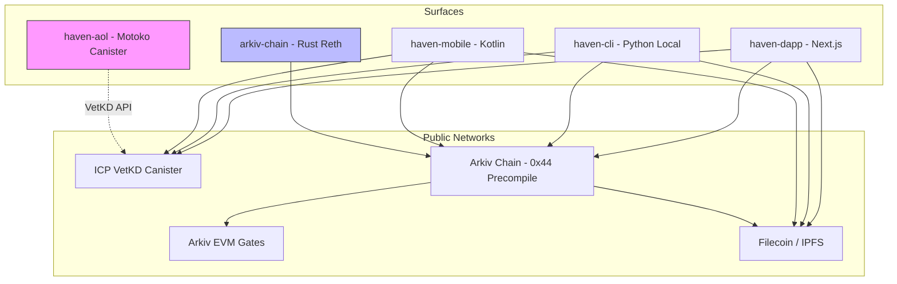
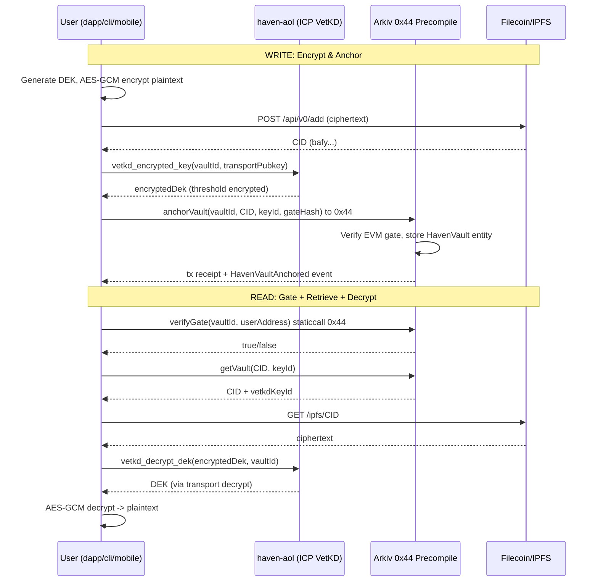
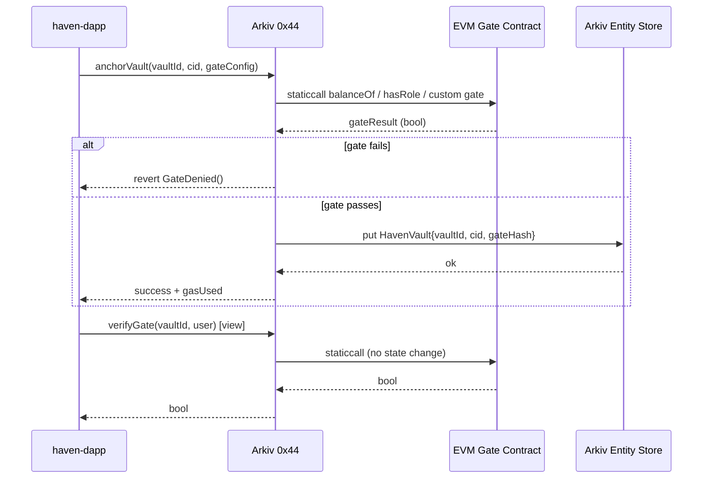

# Haven Web3 Zero Backend

## Context

**Problem:** Haven requires end-to-end encrypted, user-owned storage without operating any private backend, database, or centralized key server. Traditional architecture (API + Postgres + KMS) creates custodial risk, regulatory surface, and single point of failure. Requirement is **public networks only**.

**Why Zero Backend:** All persistence, access control, and cryptography must be verifiable on public infrastructure:
*   **ICP VetKD** for threshold key derivation and encryption (no server-held keys)
*   **Arkiv Chain 0x44 precompile** for on-chain entity anchoring and EVM gate verification
*   **EVM gates** (Arkiv EVM) for token/ownership-gated access
*   **Filecoin/IPFS** for encrypted blob storage (content-addressed, no S3)

**Success Criteria:**
1.  User can encrypt locally -> store CID on Arkiv via 0x44 -> retrieve and decrypt via VetKD without any Haven-operated server in the path.
2.  EVM gate evaluation is deterministic on-chain (Arkiv precompile), not in a backend.
3.  All 5 surfaces (arkiv-chain, haven-aol, haven-dapp, haven-cli, haven-mobile) operate against public RPCs only. Loss of any Haven domain does not cause data loss.
4.  No PII or plaintext ever touches Filecoin/IPFS or Arkiv storage; only ciphertext + CIDs + VetKD-encrypted DEKs.

TBD: Exact Filecoin storage deal parameters (retrievability vs. IPFS pinning only for MVP).

## Current Architecture

<!-- CORBELL_GRAPH_START -->
### Service Graph

**arkiv-chain** (`arkiv-chain`, rust, type: service)

### All Known Services
- `arkiv-chain` (rust) tags: ['chain', 'entity', 'precompile', 'reth', 'core', 'decoupled']
- `haven-aol` (python) tags: ['core', 'icp-canister', 'vetkd', 'cryptography', 'decoupled']
- `haven-dapp` (typescript) tags: ['frontend', 'nextjs', 'web3', 'decoupled']
- `haven-cli` (python) tags: ['cli', 'tui', 'tooling', 'decoupled']
- `haven-mobile` (kotlin) tags: ['mobile', 'kotlin', 'android', 'decoupled']
<!-- CORBELL_GRAPH_END -->

Current state is fully decoupled with no shared private backend. `arkiv-chain` is the only service with discovered code graph (reth-based Rust chain). Other surfaces are registered but code embeddings not yet built (`corbell embeddings:build` returned 0 chunks). Tag metadata for `haven-aol` reports `python` but PRD specifies **Motoko ICP canister** - graph metadata is stale; design treats `haven-aol` as Motoko canister as source of truth.

No centralized API, no shared Postgres, no queue. Each surface talks directly to public networks. This is intentional and must be preserved.



## Proposed Design

### Service Changes

> **Code Context Note:** `corbell embeddings:build` returned 0 chunks. No existing file paths were discoverable. All file paths below are **FILES TO BE CREATED** - no existing code to show. Design proposes canonical paths per surface conventions.

#### 1. `arkiv-chain` (rust, reth) - 0x44 Precompile & Entity

New precompile at address `0x0000000000000000000000000000000000000044` for Haven vault anchoring and gate verification. No off-chain indexer.

**Files to be created:**
*   `arkiv-chain/src/precompiles/haven.rs` - 0x44 implementation
*   `arkiv-chain/src/entity/haven_vault.rs` - Entity storage schema
*   `arkiv-chain/crates/precompile/src/haven_gate.rs` - EVM gate logic

```rust
// FILE TO BE CREATED: arkiv-chain/src/precompiles/haven.rs
// Existing pattern: reth precompiles implement Precompile trait
// No existing code found - proposed interface:

use reth_precompile::{Precompile, PrecompileResult};

pub const HAVEN_PRECOMPILE_ADDRESS: Address = address!("0000000000000000000000000000000000000044");

pub struct HavenPrecompile;

impl Precompile for HavenPrecompile {
    fn execute(input: &[u8], gas_limit: u64) -> PrecompileResult {
        // input: abi.encode(vaultId, ipfsCid, vetKdKeyId, gateConfig)
        // 1. Verify EVM gate (ERC20/721 balance, allowlist) via staticcall to Arkiv EVM
        // 2. Store Entity::HavenVault { owner, cid, keyId, gateHash, blockNumber }
        // 3. Emit HavenVaultAnchored(vaultId, cid, owner)
        todo!()
    }
    fn gas_cost(input: &[u8]) -> u64 { 15000 + (input.len() as u64 * 10) }
}

// FILE TO BE CREATED: arkiv-chain/src/entity/haven_vault.rs
#[derive(Entity, Serialize)]
pub struct HavenVault {
    #[primary_key] pub vault_id: B256, // keccak256(owner + nonce)
    pub owner: Address,
    pub ipfs_cid: String, // CIDv1, max 128 chars
    pub vetkd_key_id: Vec<u8>, // VetKD derivation path
    pub gate_hash: B256, // hash of gate config for verification
    pub created_at: u64,
}
```

Env vars: `ARKIV_HAVEN_PRECOMPILE_ENABLED=true`, `ARKIV_RPC_URL` (public).

#### 2. `haven-aol` (Motoko ICP Canister) - VetKD Coordinator

Thin canister wrapping `vetkd` system API. No private key storage. Stable memory only for encrypted DEKs.

**Files to be created:**
*   `haven-aol/src/haven_aol/main.mo`
*   `haven-aol/src/haven_aol/vetkd.mo`

```motoko
// FILE TO BE CREATED: haven-aol/src/haven_aol/main.mo
// Motoko canister - VetKD threshold key derivation
import VetKD "mo:vetkd";

actor HavenAOL {
  stable var encryptedDeks : TrieMap<Principal, Blob> = TrieMap.empty();

  // Called by dapp/cli/mobile - derives key for caller, never returns plaintext server-side
  public shared(msg) func vetkd_encrypted_key(vaultId: Blob, transportPubkey: Blob) : async Blob {
    // 1. Derive VetKD key: vetkd_derive_key(vaultId, msg.caller)
    // 2. Encrypt DEK with transportPubkey (client ephemeral)
    // 3. Return encrypted blob - client decrypts locally with transport private key
    let derived = await VetKD.derive_key(vaultId, msg.caller);
    VetKD.encrypt_for_transport(derived, transportPubkey)
  };

  public shared(msg) func vetkd_decrypt_dek(encryptedDek: Blob, vaultId: Blob) : async Blob {
    // Threshold decryption - only if caller passes Arkiv gate proof (verified via 0x44)
    // Verify gate proof by calling Arkiv RPC (public) inside canister via HTTPS outcall
    await VetKD.decrypt(encryptedDek, vaultId, msg.caller)
  };
}
```

Canister ID env: `VETKD_CANISTER_ID`, `HAVEN_AOL_CANISTER_ID`. No secrets in canister.

#### 3. `haven-dapp` (typescript, nextjs) - Primary UI

All crypto client-side. Uses `viem` for Arkiv, `@dfinity/agent` for VetKD, `helia`/`kubo` for IPFS.

**Files to be created:**
*   `haven-dapp/src/lib/vetkd.ts`
*   `haven-dapp/src/lib/arkiv.ts`
*   `haven-dapp/src/lib/ipfs.ts`
*   `haven-dapp/src/app/vault/page.tsx`

```typescript
// FILE TO BE CREATED: haven-dapp/src/lib/vetkd.ts
// No existing code - proposed client-side VetKD flow
import { vetkd } from '@dfinity/vetkd';
import { HavenAOLCanister } from '@/lib/canister';

export async function encryptVault(plaintext: Uint8Array, vaultId: string): Promise<{cid: string, encryptedDek: Uint8Array}> {
  // 1. Generate random DEK (AES-256-GCM)
  const dek = crypto.getRandomValues(new Uint8Array(32));
  const ciphertext = await aesGcmEncrypt(plaintext, dek);
  // 2. Upload ciphertext to IPFS -> CID
  const cid = await ipfsAdd(ciphertext); // via public gateway or helia
  // 3. Encrypt DEK via VetKD (transport key)
  const transportKeypair = generateTransportKeypair();
  const encryptedDek = await HavenAOLCanister.vetkd_encrypted_key(
    hexToBlob(vaultId), transportKeypair.publicKey
  );
  return { cid, encryptedDek: vetkd.decryptWithTransport(encryptedDek, transportKeypair.privateKey) };
}

// FILE TO BE CREATED: haven-dapp/src/lib/arkiv.ts
export const HAVEN_PRECOMPILE_ABI = [
  "function anchorVault(bytes32 vaultId, string cid, bytes keyId, bytes32 gateHash) external",
  "function verifyGate(bytes32 vaultId, address user) view returns (bool)"
] as const;
export const HAVEN_PRECOMPILE_ADDRESS = "0x0000000000000000000000000000000000000044";
```

Env vars (public, no secrets): `NEXT_PUBLIC_ARKIV_RPC_URL`, `NEXT_PUBLIC_IPFS_GATEWAY_URL`, `NEXT_PUBLIC_VETKD_CANISTER_ID`.

#### 4. `haven-cli` (python, local) - Offline-first tooling

Local TUI, no backend. Direct RPC calls.

**Files to be created:**
*   `haven-cli/haven_cli/vault.py`
*   `haven-cli/haven_cli/crypto/vetkd.py`

```python
# FILE TO BE CREATED: haven-cli/haven_cli/vault.py
# Local-only, no server
import ipfshttpclient
from eth_account import Account
from haven_cli.crypto.vetkd import vetkd_encrypt_dek

def vault_put(file_path: str, gate_config: dict):
    # 1. Encrypt file locally with DEK
    dek = os.urandom(32)
    ciphertext = aes_gcm_encrypt(open(file_path,'rb').read(), dek)
    # 2. IPFS add via public gateway or local kubo
    cid = ipfshttpclient.connect('/ip4/127.0.0.1/tcp/5001').add_bytes(ciphertext)
    # 3. VetKD encrypt DEK via haven-aol canister (HTTPS)
    encrypted_dek = vetkd_encrypt_dek(dek, vault_id)
    # 4. Anchor on Arkiv via 0x44 precompile
    tx = arkiv_contract.functions.anchorVault(vault_id, cid, encrypted_dek, gate_hash).build_transaction()
    return cid
```

#### 5. `haven-mobile` (kotlin, android) - Native

Uses `ic4j` for VetKD, `web3j` for Arkiv, `ipfs-lite` for retrieval.

**Files to be created:**
*   `haven-mobile/app/src/main/java/com/haven/mobile/vault/VaultRepository.kt`
*   `haven-mobile/app/src/main/java/com/haven/mobile/crypto/VetKDClient.kt`

```kotlin
// FILE TO BE CREATED: haven-mobile/app/src/main/java/com/haven/mobile/vault/VaultRepository.kt
class VaultRepository(
    private val arkivRpc: String, // public RPC
    private val vetkdCanister: String,
    private val ipfsGateway: String
) {
    suspend fun fetchVault(vaultId: String, userAddress: String): ByteArray {
        // 1. Verify gate via 0x44 static call
        val hasAccess = arkivClient.verifyGate(vaultId, userAddress)
        if (!hasAccess) throw GateDeniedException()
        // 2. Fetch CID from Arkiv entity
        val cid = arkivClient.getVaultCid(vaultId)
        // 3. Fetch ciphertext from IPFS (Filecoin gateway)
        val ciphertext = ipfsClient.cat(cid)
        // 4. Decrypt DEK via VetKD (threshold decrypt)
        val dek = vetkdClient.decryptDek(vaultId)
        return aesGcmDecrypt(ciphertext, dek)
    }
}
```

### Data Flow





### API Contracts

No private REST API. All contracts are public network interfaces:

**1. Arkiv 0x44 Precompile (EVM ABI)**
```solidity
// Address: 0x0000000000000000000000000000000000000044
function anchorVault(bytes32 vaultId, string calldata cid, bytes calldata vetKdKeyId, bytes32 gateHash) external returns (bool);
function getVault(bytes32 vaultId) external view returns (address owner, string memory cid, bytes memory vetKdKeyId, bytes32 gateHash, uint64 createdAt);
function verifyGate(bytes32 vaultId, address user) external view returns (bool passed, bytes memory reason);
event HavenVaultAnchored(bytes32 indexed vaultId, address indexed owner, string cid, bytes32 gateHash);
```
Request shape: `vaultId = keccak256(abi.encode(owner, nonce))`, `cid` = CIDv1 string, `vetKdKeyId` = `principal + vaultId` bytes, `gateHash` = `keccak256(abi.encode(gateConfig))`.
Error: `GateDenied(string reason)`, `InvalidCID()`, `VaultExists()`.

**2. haven-aol VetKD Canister (Candid)**
```candid
service : {
  vetkd_encrypted_key: (blob vaultId, blob transportPubkey) -> (blob encryptedDek);
  vetkd_decrypt_dek: (blob encryptedDek, blob vaultId) -> (blob dek) ;
  get_encrypted_dek: (blob vaultId) -> (opt blob) query;
}
```
Transport encryption uses VetKD `vetkd_derive_encrypted_key` + `vetkd_encrypted_key` system API. Caller must be vault owner or pass gate proof (verified via HTTPS outcall to Arkiv RPC).

**3. IPFS/Filecoin (Public Gateway)**
```
POST https://ipfs.filecoin.io/api/v0/add -> { Hash: "bafy..." }
GET https://w3s.link/ipfs/{cid} -> ciphertext bytes
GET https://gateway.pinata.cloud/ipfs/{cid} -> fallback
```
Client tries 3 gateways with fallback. No Haven gateway.

TBD: Filecoin deal-making API (Lighthouse/web3.storage) for persistent storage vs. pure IPFS pinning.

### Failure Modes and Mitigations

| Failure Mode | Impact | Mitigation |
|---|---|---|
| **ICP VetKD timeout / subnet down** | Encrypt/decrypt fails, p99 ~2-4s | Client retry with exponential backoff (3 retries, 500ms base, jitter). Circuit breaker: after 5 failures, show "VetKD unavailable" and queue operation locally (IndexedDB / local file). No dead-letter queue server-side; client-side retry queue with `localStorage` persistence. |
| **Arkiv RPC timeout / 0x44 revert** | Anchor fails, gate check fails | Retry with alternate public RPC (env `ARKIV_RPC_URLS` comma-separated). `viem` fallback transport. For `GateDenied`, surface reason to user, no retry. Gas estimation failure -> suggest increase gasLimit 20%. |
| **IPFS gateway timeout / CID not found** | Ciphertext unavailable | Multi-gateway fallback: `w3s.link` -> `gateway.pinata.cloud` -> `ipfs.io` -> local Kubo if `haven-cli`. Retry 3x per gateway. Pin to 2 providers on write (web3.storage + Filecoin deal). Show "Retrieving from Filecoin..." with 30s timeout. |
| **EVM gate evaluation reverts** | User incorrectly denied | Precompile does `staticcall` with 50k gas limit, catches revert and returns `false, reason`. Client displays gate requirement (e.g., "Hold 1 Haven NFT"). No cascade - gate logic is pure view. |
| **Transport key mismatch (VetKD)** | Decrypt fails | Client regenerates transport keypair per session, never reuses. Validate `transportPubkey` length 32 bytes before call. |
| **Filecoin deal not sealed** | Data not persistent | MVP uses IPFS pinning only; Filecoin deals async via Lighthouse. Background worker in dapp/cli retries deal proposal. CID remains retrievable via IPFS even if deal pending. |
| **Mobile offline** | No network | Kotlin `VaultRepository` caches last successful `HavenVault` metadata in Room DB + ciphertext in encrypted local storage (SQLCipher). VetKD decrypt requires online - queue decrypt for when online. |
| **Rate limiting (public gateways)** | 429 | Client-side rate limiter: max 10 IPFS fetches / 10s, 5 VetKD calls / 10s. Backoff 1s, 2s, 4s. No server to rate limit. |
| **Chain reorg** | Vault anchor reverted | Wait for 2 confirmations before showing success. Listen to `HavenVaultAnchored` event, confirm blockNumber. |

No centralized dead-letter queue; all retries are client-side with `Retry-After` handling. Circuit breaker pattern implemented in `haven-dapp/src/lib/retry.ts` and `haven-mobile/.../RetryInterceptor.kt`.

## Reliability and Risk Constraints

<!-- CORBELL_CONSTRAINTS_START -->
**Haven Zero Backend Constraints (public networks only):**
- No private backend, no centralized database, no custodial key server - all state on Arkiv chain, ICP, or IPFS/Filecoin
- All PII and plaintext must be encrypted client-side before leaving device; only ciphertext and CIDs on public networks
- VetKD is sole key management - no custom KMS, no server-held private keys
- p99 latency for Arkiv 0x44 view calls < 200ms, VetKD encrypt/decrypt < 4s (threshold consensus), IPFS fetch < 2s (gateway)
- Must survive single public network degradation (fallback RPCs/gateways, no SPOF)
- Rate limit all external public RPC/gateway calls client-side to prevent cascade
- All EVM gate logic must be deterministic and verifiable on-chain via 0x44 precompile
<!-- CORBELL_CONSTRAINTS_END -->

**SLOs:**
*   Arkiv 0x44 `verifyGate` (view): p99 < 200ms, error rate < 0.1%, availability 99.9% (via multiple RPCs)
*   VetKD `vetkd_encrypted_key` / `vetkd_decrypt_dek`: p99 < 4000ms (ICP consensus), error rate < 0.5%, retry success > 99%
*   IPFS `cat` via gateway: p99 < 2000ms, fallback success > 99.5%
*   End-to-end vault create (encrypt + IPFS + anchor): p95 < 8s

**Capacity:** No backend to scale. Client-side concurrency limited to 3 parallel IPFS uploads, 1 VetKD call at a time. Arkiv chain handles throughput; precompile gas cost 15k + 10*bytes ensures DoS resistance.

**Security:**
*   PII encrypted at rest (AES-256-GCM) and in transit (TLS to RPCs + VetKD transport encryption). No plaintext in logs.
*   VetKD derivation path includes `vaultId + caller Principal` - prevents cross-vault key reuse.
*   EVM gates evaluated on-chain, not client-side - prevents bypass.
*   Content addressing (CID) ensures integrity - client verifies `hash(ciphertext) == CID` on fetch.

## Rollout Plan

**Phase 0 - Feature Flags (no backend flags, client-side):**
*   Env flags: `NEXT_PUBLIC_HAVEN_VAULT_ENABLED=false`, `HAVEN_CLI_VAULT_ENABLED`, `MOBILE_VAULT_ENABLED`. All default off. No LaunchDarkly - build-time env.
*   Arkiv precompile gated by `HAVEN_PRECOMPILE_ENABLED` chain config, initially on Arkiv testnet only.

**Phase 1 - Canary (testnet, 5% of internal users):**
*   Deploy `haven-aol` canister to ICP testnet, `arkiv-chain` 0x44 to Arkiv testnet.
*   Enable for Haven team wallets only (allowlist in gate config). Monitor VetKD latency, IPFS pin success, precompile gas.
*   Rollback: set flag false, no chain state to revert (testnet). Canister upgrade via `dfx canister install --mode reinstall`.

**Phase 2 - Public Testnet (50%):**
*   Publish `haven-dapp` testnet deployment, `haven-cli` beta via `pip install haven-cli --pre`, `haven-mobile` internal track.
*   Use 3 public Arkiv RPCs and 2 IPFS pinning services. Monitor error rates via client-side telemetry (PostHog, no PII).
*   Rollback: revert dapp to previous IPFS hash, cli/mobile remain functional offline with cached data.

**Phase 3 - Mainnet (100%):**
*   Deploy canister to ICP mainnet, precompile to Arkiv mainnet via chain upgrade proposal.
*   Enable flags in production builds. Announce Filecoin deal persistence.
*   Rollback procedure: chain precompile cannot be removed without hard fork - instead disable via `gateHash = 0x00` check returning `GateDenied("paused")` via precompile upgrade. Dapp rollback via Vercel instant rollback to previous deployment. No data loss - CIDs and VetKD keys remain on public networks.

**Monitoring:** Client-side metrics only - `haven-dapp/src/lib/metrics.ts` logs `vetkd_latency`, `precompile_gas_used`, `ipfs_fetch_duration` to PostHog. No server logs. Alerts on p99 VetKD > 5s or IPFS fallback rate > 5%.

